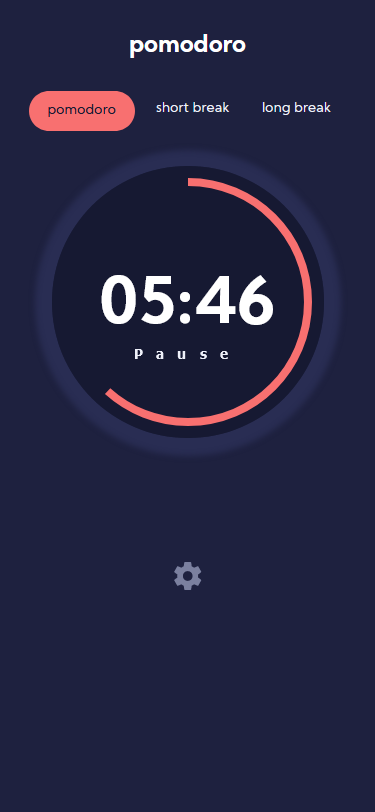
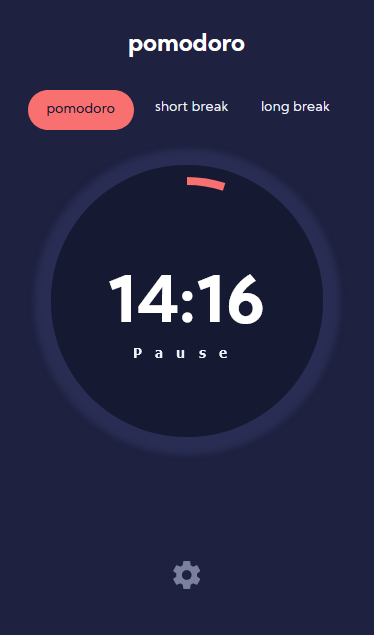
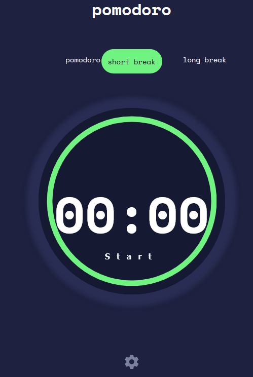
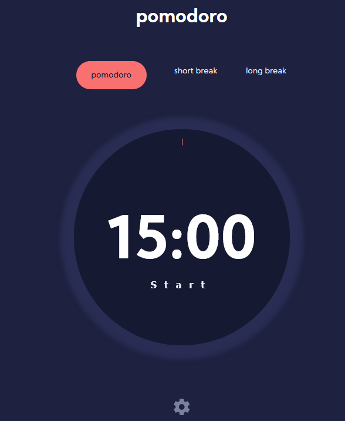

# Pomodoro Timer

URL https://pomodoro.alissanguyen.dev

A pomodoro timer built with simple HTML, JS and SCSS.

## What to expect
There are 3 modes timers that you can choose from, pomodoro , short break and long mode.
Use the  **Start** button to get the timer going, the default is the pomodoro timer.
At the bottom of the page, is a settings menu button that opens the settings page.
In the settings page , the following can be changed:
- The **pomodoro timer** can be incremented up to 90 minutes 
- The **long break** can reach a maximum of 20 minutes 
- The **short break** a maximum of 10 minutes
- There are 3 types of fonts to choose from
- and 3 colors to choose from for the ring circumference
 

